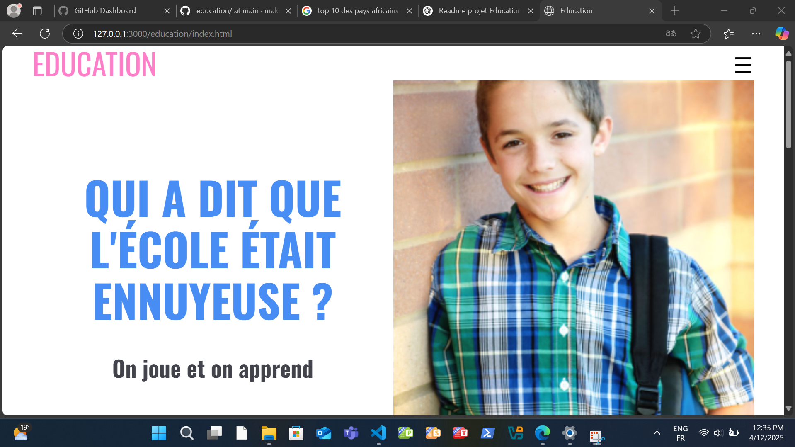

# 🎓 Education - Site Web Éducatif

Bienvenue dans le projet **Education**, une page web moderne dédiée à l’apprentissage ludique et à la découverte. Ce projet propose une interface attrayante et interactive mettant en avant l'éducation à travers le jeu, la pratique et la philosophie.

## 🌐 Aperçu

Ce site HTML propose une structure responsive avec un menu de navigation, plusieurs sections informatives, des illustrations pédagogiques, et un style dynamique grâce à l’intégration de **Font Awesome**, **Google Fonts**, et une feuille de style CSS personnalisée.

---

## 🚀 Fonctionnalités

- Design responsive avec menu burger
- Intégration de polices Google Fonts (Roboto, Oswald, Ubuntu)
- Icônes interactives via Font Awesome
- Structure claire avec sections :
  - Hero (accroche)
  - Accueil (valeurs éducatives)
  - À propos (présentation de l'école)
  - Équipe et mission (enseignants, objectifs)
- Mise en avant visuelle à travers des images et des couleurs thématiques
- Scripts JavaScript pour l’interactivité (ex: ouverture/fermeture du menu)

---

## 🛠️ Technologies utilisées

- HTML5
- CSS3 (avec un reset CSS)
- JavaScript (fichier `script.js`)
- [Font Awesome](https://fontawesome.com/)
- [Google Fonts](https://fonts.google.com/)

---

---

## 📸 Capture d’écran

Quelques sections notables :

- **Accueil**
  

- **À propos**
  

- **Enseignants et mission**
  

---

## 📌 À améliorer / Bugs connus

- Certains articles de la section "grid" utilisent la classe `bug`, à corriger ou renommer pour plus de clarté.
- Ajustements responsives à finaliser sur certains écrans (notamment sur bureau).
- Le contenu est pour l’instant fictif (utilise du *Lorem ipsum*).

---

## 🤝 Contribuer

Toute contribution est la bienvenue ! N'hésitez pas à forker le projet, créer des branches, ou proposer des améliorations via des pull requests.

---

## 📄 Licence

Ce projet est sous licence **MIT** — voir le fichier [LICENSE](LICENSE) pour plus de détails.

---

## ✨ Auteur

Réalisé avec ❤️ par **[Job Johnny]**

---

